# 电影购票系统（movie-ticketing-system）
页面布局参考：https://cloud.axureshop.com/48L08O

> 电影购票系统是一个综合性的在线平台，旨在为用户提供便捷的电影购票服务，同时为电影院和平台管理员提供高效的管理工具。该系统分为三个主要部分：用户端、影院管理端和平台管理端。
>
> sql文件夹中有需要的表结构和测试数据
>
> * [movie-ticketing-system-表结构.sql](sql/movie-ticketing-system-表结构.sql)
> * [movie-ticketing-system-包含测试数据.sql](sql/movie-ticketing-system-包含测试数据.sql)
>
> 图片展示仅为部分展示，功能介绍仅为部分介绍

##### 后端配置文件构成

**aliyunoss-config.properties：**阿里云oss服务配置：

* 因为安全策略，这个文件是没有上传到git库的

* ```
  oss.endpoint=oss-cn-chengdu.aliyuncs.com # 我使用的是成都的
  oss.bucketName=public-file-container #容器名称
  oss.fileUrlPrefix=https://public-file-container.oss-cn-chengdu.aliyuncs.com/ # 我使用的是成都的
  oss.accessKeyId=accessKeyId # 唯一的标识符
  oss.accessKeySecret=accessKeySecret # 密钥
  ```

**email-config.properties：**邮件的发送配置

* 因为隐私问题，这个文件是没有上传到git库的

* ```
  email.username=邮箱
  email.password=应用密码
  mail.smtp.host=smtp服务器
  mail.smtp.port=端口
  mail.smtp.auth=true
  mail.smtp.starttls.enable=true
  ```

**KEY.properties：**密钥配置

* ```
  AES_KEY=movie-ticketing-project # AES加密密钥
  JWT_KEY=b8942cc3878a41659aaacc9b151399c4 # JWT加密密钥
  JWT_EXPIRATION_TIME=36000000 # JWT有效时长
  ```

**mybaits-config.properties：**数据库配置

* ```
  datasource.host=localhost # 需要修改可以更换
  datasource.port=3306 # 需要修改可以更换
  datasource.database=movie_ticketing_system # 项目指定的数据库名是这个在表结构中有
  datasource.another=useSSL=false&serverTimezone=UTC&characterEncoding=UTF-8&allowPublicKeyRetrieval=true
  
  druid.driverClassName=com.mysql.cj.jdbc.Driver
  druid.url=jdbc:mysql://${datasource.host:localhost}:${datasource.port:3306}/${datasource.database}?${datasource.another}
  druid.username=root # 需要修改可以更换
  druid.password=123456 # 需要修改可以更换
  ```

## 数据库结构设计图


# 功能分析

## 用户端：（多端可用）

为了扩大用户群体、提升用户体验和适应移动互联网发展趋势，我设计了适配web端(`2560px`)的和移动端的ui(`768px`)

### 移动端部分展示图：

<div style="display: flex;">
  
  
  
    
    
</div>

### Web端部分展示图：

#### 登录和注册

**登录：**

* 前端：
  * 验证邮和密码格式
* 后端：
  1. 验证账户是否存在
  2. 验证账户是否可用
  3. 验证账户密码是否正确
  4. 去除敏感数据
  5. 生成token返回账户数据

**注册：**

1. 前端验证邮箱格式
2. 后端通过正确的邮箱发送随机的4位验证码到客户邮箱
3. 后端将发送的验证码存储入数据库中设置有效时间
4. 前端验证密码格式
5. 后端验证账号是否已存在
6. 后端判断验证码的正确有效性
7. 后端判断密码的合法性
8. 后端设置初始的用户名和头像

<div>
    <div style="display: flex;">
        <div style="width:50%">
            <p style="font-weight:bold;color:#e74869">
                原版登录页面
            </p>
            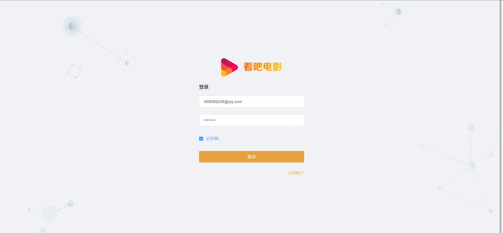
        </div>
        <div style="width:50%">
            <p style="font-weight:bold;color:#ffa63b">
                新版登录页面
            </p>
            
        </div>
    </div>
   <div style="display: flex;">
        <div style="width:50%">
            <p style="font-weight:bold;color:#e74869">
                原版注册页面
            </p>
            
        </div>
        <div style="width:50%">
            <p style="font-weight:bold;color:#ffa63b">
                新版注册页面
            </p>
            
        </div>
    </div>
</div>

#### 首页（页面）

* **接口：**
  * 获取对应的地址
  * 获取首页轮动图
  * 随机获取首页推荐的电影
* **细节点：**
  * 当用户第一次进入时没有地址，会弹出一个地址选项框让用户选择地区，影院会根据用户的地区进行推荐

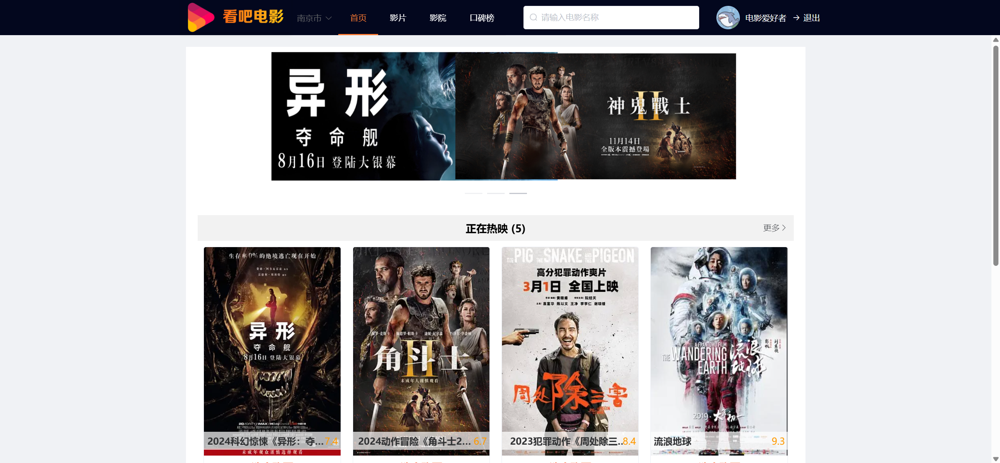

#### 影片（页面）

* **接口：**
  * 获取展示的广告，点击可用转跳到对应的网页
  * 筛选对应的电影数据分页展示到页面上

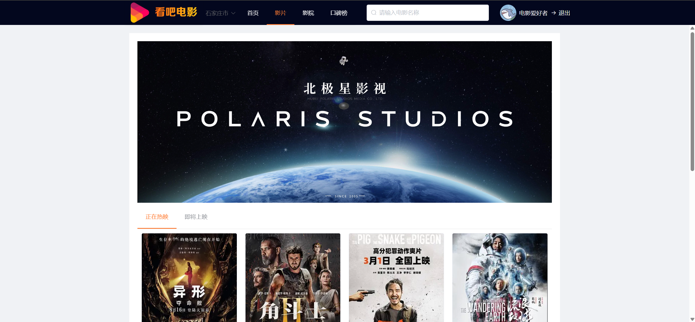

#### 评分榜（页面）

* **接口：**
  * 查询根据评分排名的电影数据


#### 电影详细（页面）

* **接口：**
  * 获取对应电影的详细数据
  * 获取品牌列表
  * 获取用户对应地区的区域列表
  * 获取有当前排片的影院列表，计算出影院排片的最低价格，并以影院评分倒序排序


#### 座位选择（页面）

*  **接口：**
  * 获取到对应排片的的座位布局
  * 获取到对应的影片数据
  * 获取到对应的排片数据
  * 点击支付后创建新的订单，后台会验证客户选择的座位的有效性，并将座位的状态修改

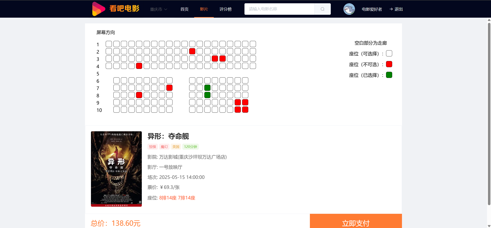

#### 订单列表（页面）

* **接口：**
  * 获取对应用户的订单列表
  * 根据不同的状态进行不同的展示
  * 用户可以根据上面的条件进行筛选订单

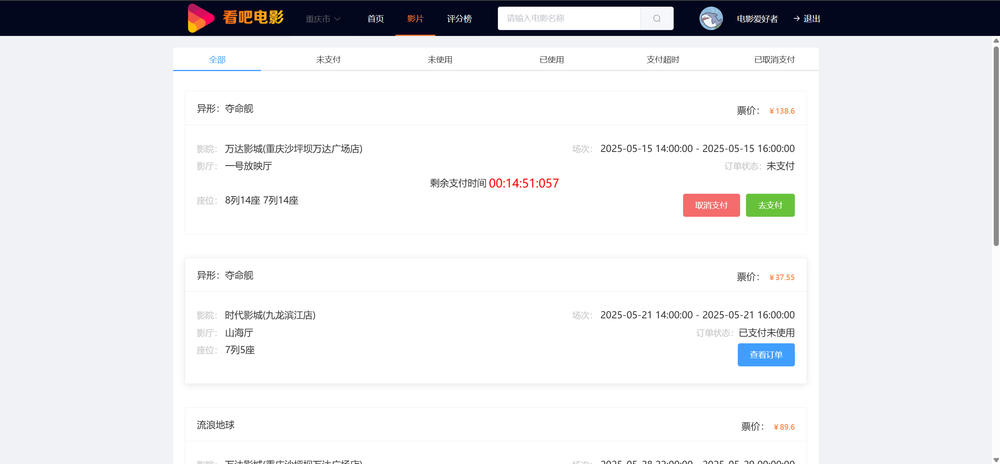

#### 细节点

* 用户点击取消支付时会主动将用户已经选择的座位状态恢复
* 当订单支付超时时会自动将用户已经选择的座位状态恢复
* 显示剩余支付时间倒计时让用户产生一种紧迫感

## 影院管理

#### 首页（页面）

* **接口：**
  * 查询近一周的售票量
  * 查询近一周的排片量
  * 查询近一周的营业额
  * 查询总营业额
  * 查询不同时间段的营业额并生成趋势统计图
  * 查询不同电影的营收并生成饼图
  * 查询不同影厅的营收并生成饼图

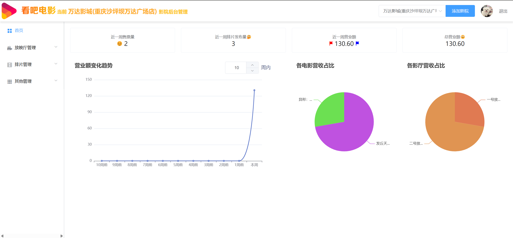

#### 放映厅管理（页面）

* **接口：**
  * 查询到放映厅的列表
  * 点击编辑可用直接对放映的布局等数据进行编辑和上传

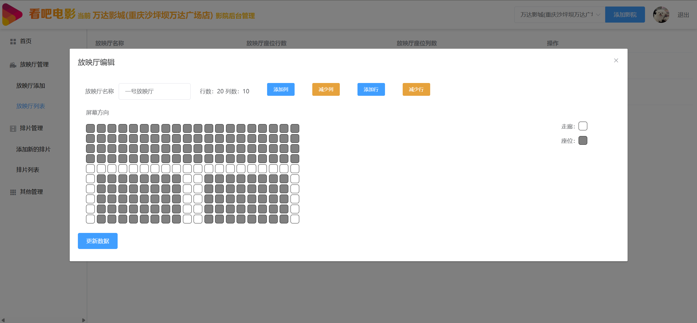

#### 售票状况（页面）

* **接口：**
  * 查询对应影院的排片，可用根据不同的参数进行筛选
  * 点击详情可用查看售票状况
  * 点击订单列表可用查看对应排片的售票详细信息

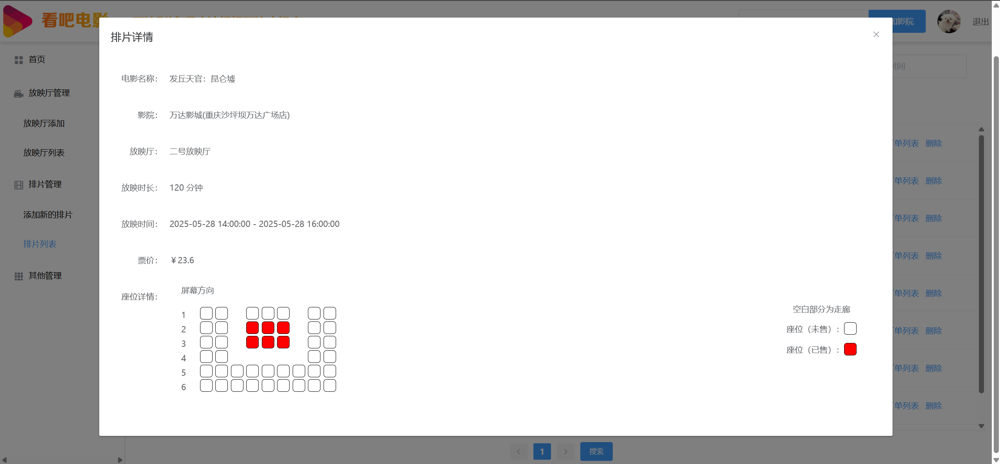

影院信息管理：

## 平台管理端

#### 首页（页面）

* **接口：**
  * 查询用户总数
  * 查询下过订单的用户数量
  * 查询影院的数量
  * 查询电影的数量
  * 查询一个月内的排片数量
  * 查询订单的总额度
  * 查询有效的营业额度
  * 查询不同区间的营业额并制作营业额变化趋势图
  * 查询不同电影的营收并制作饼图
  * 查询不同影院的营收并制作饼图
  * 查询当前的申请数量
  * 查询已支付订单的数量
  * 查询订单的总数量

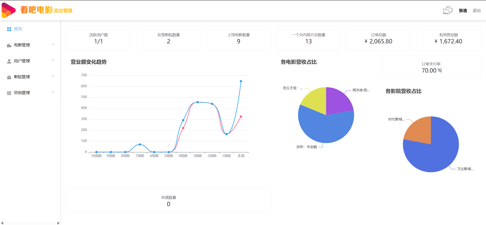

#### 电影管理

##### 新增电影（页面）

* 默认一个模板，可以修改和上传图片

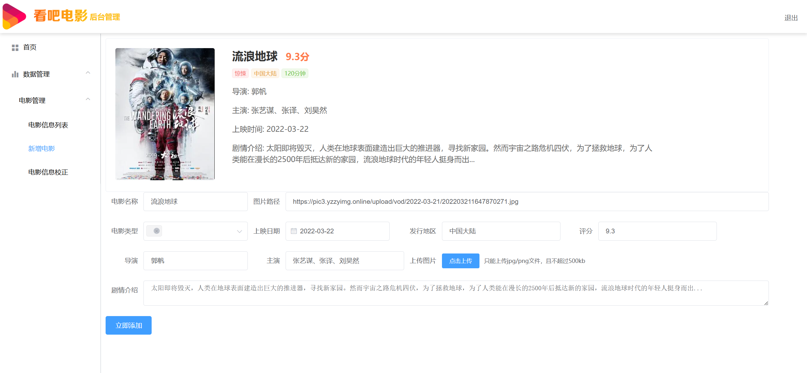

##### 电影类型管理（页面）

* 可以进行添加删除查询不同的类型标签

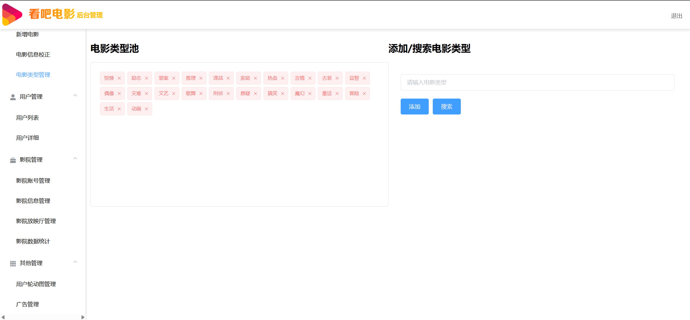

#### 用户管理

##### 用户列表（页面）

* 可以查看当前的用户，可以根据参数查询

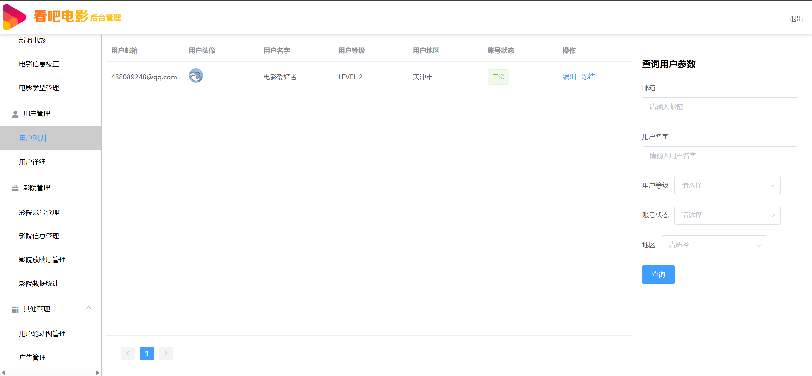

#### 用户详情（页面）

* 根据需要编辑的用户id获取到对应的用户的信息
* 管理员可以对应用户的个人信息进行编辑

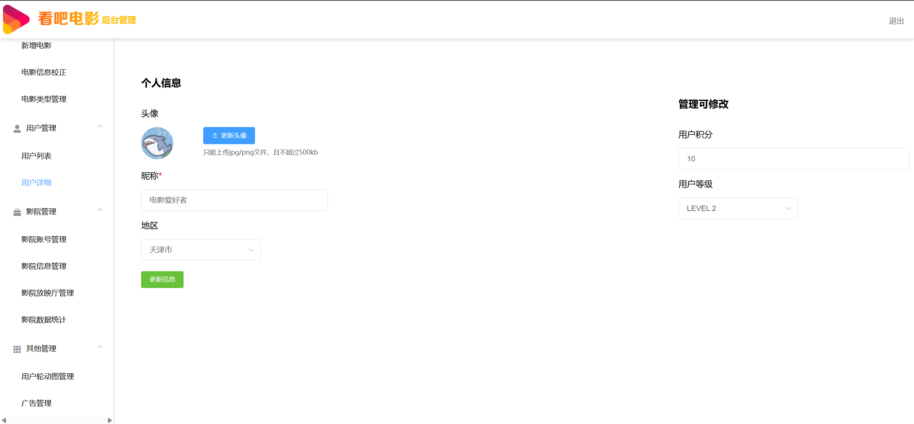

#### 其他管理

##### 用户轮动管理（页面）

* 管理员可以更新删除添加不同的轮动图

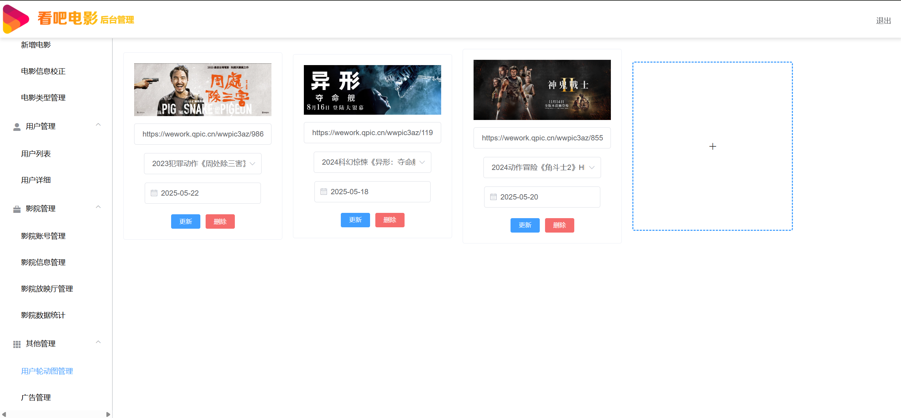
